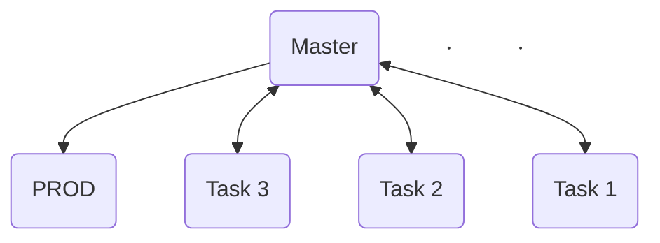

# Welcome to GOTY! lol

This note will explain our workflow. If you have any questions, please send them to [Discord](https://discord.gg/VAsXF9tM)

## Setup Project
### Required Software: 
- [Github Desktop](https://desktop.github.com/download/)
- [Unity (6000.0.27f1)](https://unity.com/releases/editor/whats-new/6000.0.27)
- [Visual Studio 2022 (Community)](https://visualstudio.microsoft.com/vs/community/)
### Prepare Environment
 - Clone the project at: https://github.com/Game-GOTY/Unity.git
 - Using the Trello task ID, create a new branch based on the `main` branch.
 - After completing your work, push a commit with the title of the Trello ID task and open a PR (Pull Request).
 - **Note:** All work will be merged into the `main` branch, and `PROD` will be merged from `master` once all work is completed.

### Github Diagram 

