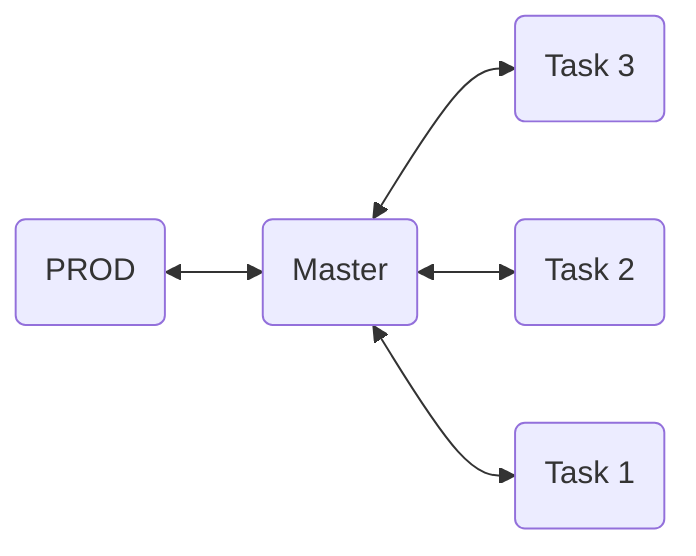

# Welcome to GOTY! lol

This note will explain our workflow. If you have any questions, please send them to [Discord](https://discord.gg/VAsXF9tM)

## Setup Project

### Required Software:

- [Github Desktop](https://desktop.github.com/download/)
- [Unity (6000.0.27f1)](https://unity.com/releases/editor/whats-new/6000.0.27)
- [Visual Studio 2022 (Community)](https://visualstudio.microsoft.com/vs/community/)

### Prepare Environment

- Clone the project at: https://github.com/Game-GOTY/Unity.git
- Using the Trello task ID, create a new branch based on the `main` branch.
- After completing your work, push a commit with the title of the Trello ID task and open a PR (Pull Request).
- **Note:** All work will be merged into the `main` branch, and `PROD` will be merged from `master` once all work is completed.

### Github Diagram



### Setup Auto Conflict Solving

- Please refer to the documentation: [Unity Smart Merge](https://docs.unity3d.com/Manual/SmartMerge.html)
- **Requirements:**
  - Git must be installed and initialized in your current repository (branch).
  - Enable ['show hidden files'](https://support.microsoft.com/en-us/windows/file-explorer-in-windows-ef370130-1cca-9dc5-e0df-2f7416fe1cb1).
  - Change Project setting:
    - Editor -> Asset Serialization -> Mode: Force Text
    - Version control -> Mode: Visible Meta Files
- Create a branch and work on it.
- Open a terminal in your local repository (PowerShell, CMD, Git Bash on Windows, or Terminal on Mac).
- Locate your `UnityYAMLMerge` file (it should be in your Unity Editor folder, not Unity Hub).
- **Run the following command** (only the bold command!):

```bash
git config merge.tool unityyamlmerge
```

- **Replace your path as shown below:**

```bash
git config mergetool.unityyamlmerge.cmd ' "D:\Unity\6000.0.27f1\Editor\Data\Tools\UnityYAMLMerge.exe" merge -p "$BASE" "$REMOTE" "$LOCAL" "$MERGED" '
```

- **To confirm the setup, run the following command:**

```bash
git config --get-all mergetool.unityyamlmerge.cmd
```

- The output should resemble:

```bash
"D:\Unity\6000.0.27f1\Editor\Data\Tools\UnityYAMLMerge.exe" merge -p "$BASE" "$REMOTE" "$LOCAL" "$MERGED"
```

- You can check in `./.git/config`, check this section

```sh
[mergetool "unityyamlmerge"]
	trustExitCode = false
	cmd = " \"D:\\Unity\\6000.0.27f1\\Editor\\Data\\Tools\\UnityYAMLMerge.exe\" merge -p \"$BASE\" \"$REMOTE\" \"$LOCAL\" \"$MERGED\" "
```

- **Set up the exit code:**

```bash
git config merge.tool.unityyamlmerge.trustExitCode true
```

- At this point, everything should be correctly configured.


### **To Solve a Conflict**

- Commit your changes, dont need open PR.
- Switch to the `master` branch in GitHub Desktop (leave your changes on your branch).
- Create a new copy of the `master` branch named **"Conflict-Solve-YourNameHere"**.
- In the branch navigation, select `Choose a branch to merge into Conflict-Solve-YourNameHere`.
- Select your branch with the changes.
- A popup will appear with `Resolve conflicts before merge`.
- Return to the terminal and run the following command:

```bash
git mergetool -t unityyamlmerge
```

- If successful, you should see output similar to this:

```sh
Merging:
Assets/Scenes/tam giac.unity

Normal merge conflict for 'Assets/Scenes/tam giac.unity':
  {local}: modified file
  {remote}: modified file
Conflicts:
Conflict handling:
warning: in the working copy of 'Assets/Scenes/tam giac.unity', LF will be replaced by CRLF the next time Git touches it
PS C:\GOTY\Game-of-the-Year>
```

- Return to GitHub Desktop. You should see a popup stating `All conflicts resolved` -> Click **Continue to merge**.
- Open another PR from your **"Conflict-Solve-YourNameHere"** branch to `master`.

Good luck!


- To Avoid Git Conflict, **Instead of having one large prefab, break it into nested or modular prefabs. Changes in one nested prefab won’t affect others, reducing the likelihood of conflicts.**

## Q/A

- **Q:** What if I open a PR from `task` to `PROD`?

  - **A:** You cannot merge it to `PROD`. Edit the target branch to `master` instead.
    <br>

- **Q:** I want to merge it to `PROD`. How can I do that?

  - **A:** The only option to merge changes to `PROD` is using the `master` branch. Please confirm with the PM before proceeding, and you will need authorization to do so. Make sure all content is up to date!
    <br>

- **Q:** How can I start a new task?

  - **A:** Use the Trello ID as the branch name and title for your PR. Create a new branch using `master` only. (Do a `fetch origin` before creating a new branch to ensure you have up-to-date content and avoid Git conflicts.)
    <br>

- **Q:** What should I do if I have a Git conflict?
  - **A:** Manually resolve it. If it's a binary file, pray! :)
