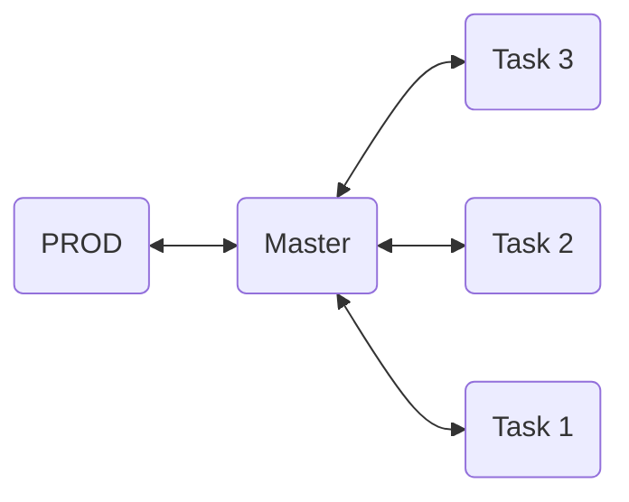

# Welcome to GOTY! lol

This note will explain our workflow. If you have any questions, please send them to [Discord](https://discord.gg/VAsXF9tM)

## Setup Project

### Required Software:

- [Github Desktop](https://desktop.github.com/download/)
- [Unity (6000.0.27f1)](https://unity.com/releases/editor/whats-new/6000.0.27)
- [Visual Studio 2022 (Community)](https://visualstudio.microsoft.com/vs/community/)

### Prepare Environment

- Clone the project at: https://github.com/Game-GOTY/Unity.git
- Using the Trello task ID, create a new branch based on the `main` branch.
- After completing your work, push a commit with the title of the Trello ID task and open a PR (Pull Request).
- **Note:** All work will be merged into the `main` branch, and `PROD` will be merged from `master` once all work is completed.

### Github Diagram

## Q/A

- **Q:** What if I open a PR from `task` to `PROD`?

  - **A:** You cannot merge it to `PROD`. Edit the target branch to `master` instead.
     

- **Q:** I want to merge it to `PROD`. How can I do that?

  - **A:** The only option to merge changes to `PROD` is using the `master` branch. Please confirm with the PM before proceeding, and you will need authorization to do so. Make sure all content is up to date!
     

- **Q:** How can I start a new task?

  - **A:** Use the Trello ID as the branch name and title for your PR. Create a new branch using `master` only. (Do a `fetch origin` before creating a new branch to ensure you have up-to-date content and avoid Git conflicts.)
     

- **Q:** What should I do if I have a Git conflict?
  - **A:** Manually resolve it. If it's a binary file, pray! :)
